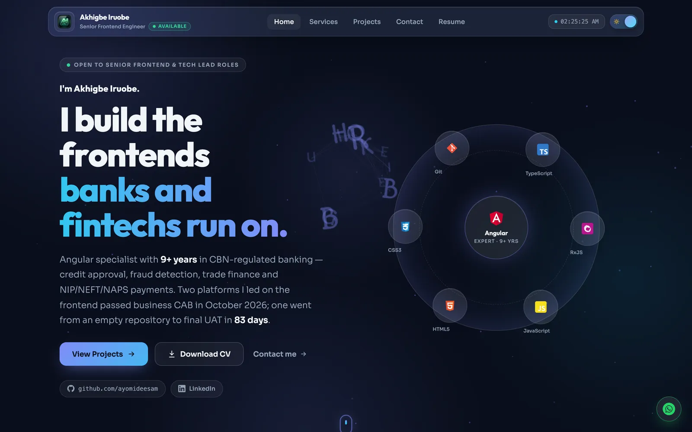
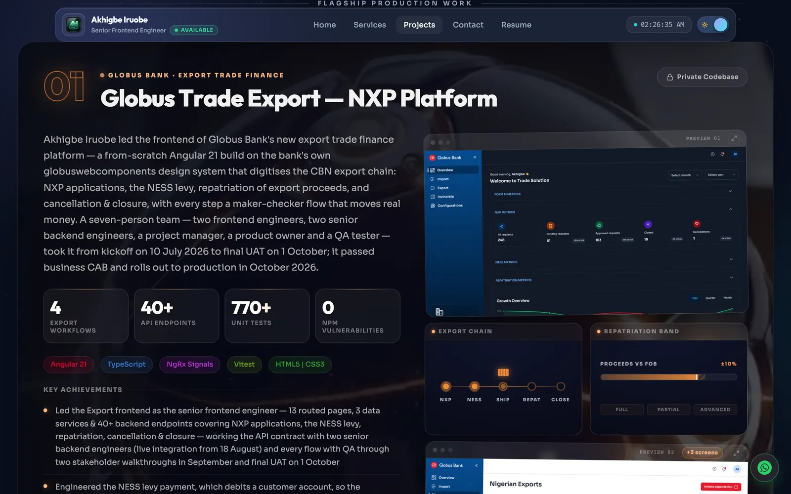
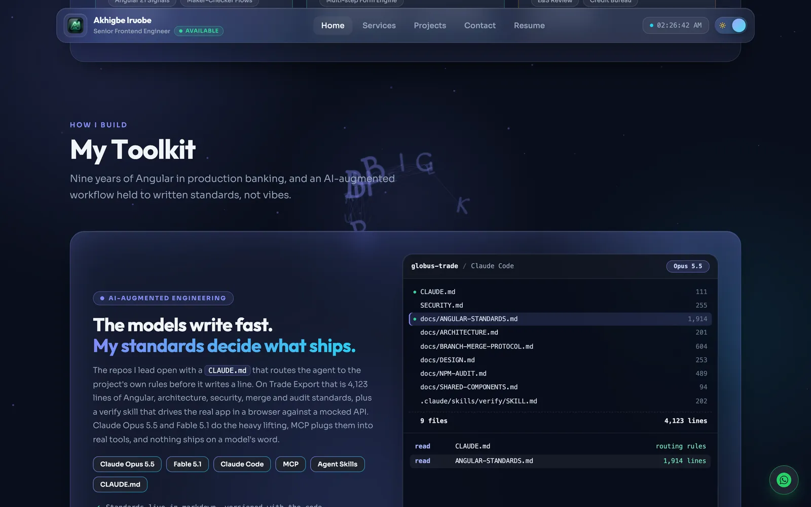
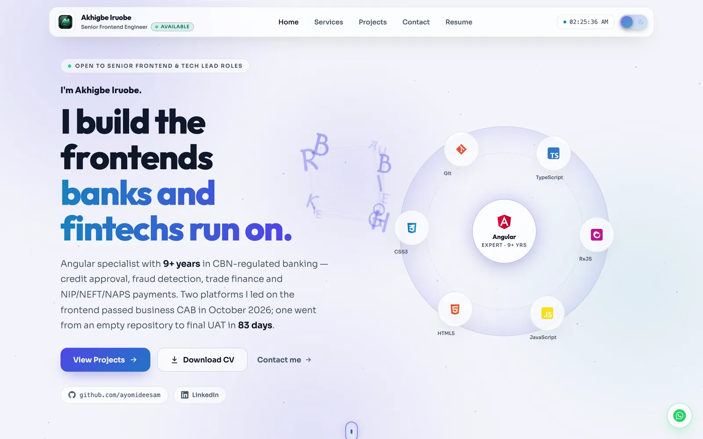
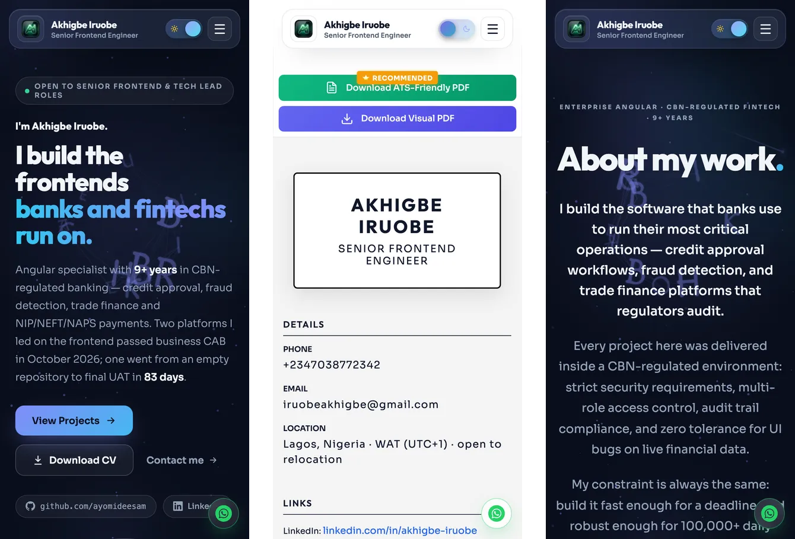

# Akhigbe Iruobe — Portfolio

**Senior Frontend Engineer · Angular specialist · Fintech & banking**
Live at **[iruobeakhigbe.netlify.app](https://iruobeakhigbe.netlify.app/)** · [Download my CV](https://iruobeakhigbe.netlify.app/resume) · [LinkedIn](https://www.linkedin.com/in/akhigbe-iruobe/)

[](https://github.com/ayomideesam/iruobe-akhigbe-portfolio/actions/workflows/ci.yml)




I build the frontends banks and fintechs run on: credit approval, fraud detection, trade finance and
NIP/NEFT/NAPS payments, inside CBN-regulated banks. The bank code I write is private, so **this repository
is the code to read**. It is held to the same standards as the production work it describes.

---

## What to look at

| If you are… | Start here |
|---|---|
| Hiring for a frontend or tech-lead role | The [live site](https://iruobeakhigbe.netlify.app/), then [Projects](https://iruobeakhigbe.netlify.app/projects): seven banking and fintech platforms, each with an "Under the hood" engineering panel |
| An engineer reviewing the code | [`ats-pdf.service.ts`](src/app/core/services/ats-pdf.service.ts), [`pdf.service.ts`](src/app/core/services/pdf.service.ts), [`home.component.ts`](src/app/pages/home/components/home.component.ts), and [`CLAUDE.md`](CLAUDE.md) for the rules the code follows |
| Interested in delivery discipline | [`docs/NPM-AUDIT.md`](docs/NPM-AUDIT.md), [`scripts/check-overrides.mjs`](scripts/check-overrides.mjs), [`scripts/check-deploy-config.mjs`](scripts/check-deploy-config.mjs) |

## Engineering highlights

- **Angular 22 on the esbuild application builder.** NgModule feature areas, lazy-loaded routes and a
  158 kB (gzipped) initial bundle against a 250 kB budget. Heavy libraries (jsPDF, html2canvas) load only
  when someone asks for a PDF.
- **Tests that guard behaviour *and* truth.** 109 Vitest tests (jsdom) cover services, routing data and
  component logic. They also fail the build if a portfolio claim drifts from its source: the home page
  and the CV must agree on dates, and figures that could not be backed cannot come back.
- **Dependency hygiene as policy.** `npm audit` is at 0 across dev and production trees. It is backed by a
  living [audit log](docs/NPM-AUDIT.md) and a script that rejects any `overrides` entry that forces a
  version outside its consumer's range.
- **A deploy guard born from a real outage.** After an Angular 22 migration silently broke Netlify's
  runtime plugin, a `prebuild` check now fails fast if `angular.json`, `netlify.toml` and `.nvmrc`
  disagree.
- **Accessibility measured, not assumed.** axe-core finds 0 WCAG 2.1 AA violations on every route in
  both themes. The site has a skip link, focus moves on navigation, motion respects
  `prefers-reduced-motion`, and touch targets are at least 24 px.
- **Responsive from a 320 px phone to a 4K screen.** Every route is checked at 19 viewports. On 27″ QHD
  and 4K displays the shell scales through a `--z` zoom factor (with a `uiScale()` helper for scripts that
  mix visual and layout pixels), so the design never shrinks into a narrow column.
- **GPU-only motion.** Keyframes animate `transform` and `opacity` only. Animations start when scrolled
  into view and pause off-screen.
- **The CV is generated in the browser.**
  - The ATS PDF is single-column jsPDF with clickable contact links and document metadata, and it was
    verified to parse in reading order.
  - The visual PDF is a desktop-width capture split into A4 pages column by column. It carries an
    invisible text layer, so it stays searchable and machine-readable.
- **Media pipeline.** `sharp` turns master images into hashed AVIF and WebP with a typed manifest, and a
  spec fails if any project image is missing a variant.
- **SEO as an entity, not keywords.** One stable `Person` `@id` across every route, `ProfilePage` schema
  on the home page, and complete Open Graph and Twitter cards.

## Screenshots

| Projects | Toolkit |
|---|---|
|  |  |

| Light theme | Phones |
|---|---|
|  |  |

## Stack

| Area | Choice |
|---|---|
| Framework | Angular 22 (NgModules, zone.js change detection), TypeScript 6 |
| Build | `@angular/build:application` (esbuild, Vite dev server) |
| Tests | Vitest 5 + jsdom through `ng test` |
| Styling | Component-scoped CSS with design tokens in `src/styles.css`, dark and light themes |
| PDFs | jsPDF (ATS resume), html2canvas + jsPDF (visual resume) |
| Media | sharp → AVIF/WebP, hashed and listed in a typed manifest |
| Hosting | Netlify, configured in [`netlify.toml`](netlify.toml) with SPA redirects and cache headers |

## Run it locally

Requires Node **22.23.3** (pinned in [`.nvmrc`](.nvmrc)).

```bash
nvm use
npm ci
npm start              # http://localhost:3000
npm test               # Vitest, single run with: npx ng test --watch=false
npm run build          # runs the deploy-config check first, then ng build
npm run optimize:media # after adding or replacing any image or video
```

## Project structure

```
src/app/
  core/services/     data (projects, resume, services, testimonials), SEO, theme, PDF generation
  core/utils/        small shared helpers (large-display scaling)
  pages/             home, services, projects, resume, contact (lazy-loaded feature modules)
  shared/            header, footer, learning journey and other reusable components
scripts/             media optimisation, override and deploy-config checks
docs/                audit log, media pipeline, standards
```

## How it is built

I build with an AI-augmented workflow (Claude Code with Claude Opus 5.5 and Fable 5.1, plus MCP),
governed by written standards rather than prompts. [`CLAUDE.md`](CLAUDE.md) is the project's
constitution: responsiveness targets, the animation rules, the SEO entity rules, the accessibility bar,
the npm-audit policy and the commit conventions. Any change, by me or by an agent, is checked against it,
and nothing ships until the build, the tests and the audit agree.

## Licence

The source code is released under the [MIT licence](LICENSE). The written content, CV, screenshots,
photographs and project images are © Akhigbe Iruobe and are not covered by that licence.
